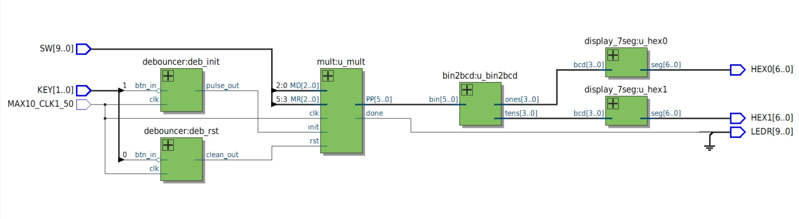
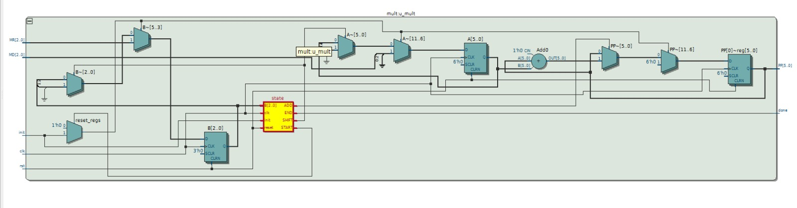
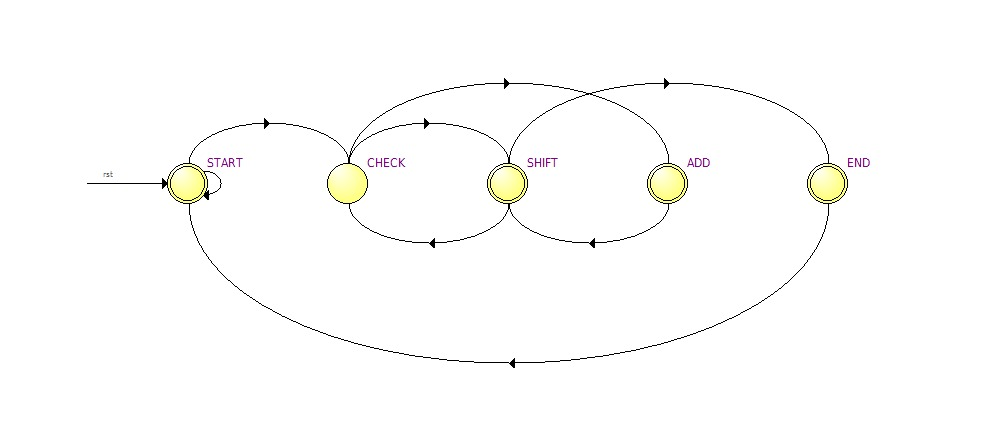
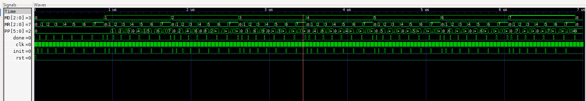

## Lab 03 Multiplicadora de 3×3 bits

## Integrantes
* [Pedro Felipe Jimenez Celis](https://github.compedrofejimenezce-ship-it) 
* [Laura Alejandra Fuentes Ubaque](https://github.com/lauAlejandrxf) 
* [Sebastian Buitrago Oliveros](https://github.com/SebastianBuitrago16) 

## Introducción
Este proyecto es una calculadora multiplicadora de 3×3 bits en una FPGA DE10-Lite: al presionar init (con anti-rebote), una máquina de estados ejecuta el algoritmo shift-and-add ciclo a ciclo hasta obtener el producto, que luego se convierte a BCD y se muestra en dos displays de 7 segmentos, con un LED indicador de "listo".
## Explicación de codigo

*Antirebote de botones* 

    reg btn_sync_0;
    reg btn_sync_1;
    always @(posedge clk) begin
        btn_sync_0 <= btn_in;
        btn_sync_1 <= btn_sync_0;
    end
Sincronizador de 2 flip-flops: pasa la señal cruda del botón por dos registros en cascada para evitar metaestabilidad (la señal física no está sincronizada con el reloj).

    reg [18:0] count;
    always @(posedge clk) begin
        if (btn_sync_1 != clean_out) begin
            count <= count + 1'b1;
            if (count == 19'd500_000) begin
                clean_out <= btn_sync_1;
                count <= 19'd0;
            end
        end else begin
            count <= 19'd0;
        end
    end

Contador de estabilidad: mientras la entrada sincronizada difiera del valor "limpio" actual, cuenta ciclos de reloj. Si se mantiene diferente durante 500,000 ciclos (10 ms a 50 MHz), recién ahí actualiza clean_out. Si en el camino la señal vuelve a su valor anterior (rebote), el contador se reinicia — así se filtra el ruido mecánico del botón.

    always @(posedge clk) begin
    clean_out_prev <= clean_out;
    pulse_out      <= clean_out && !clean_out_prev;
    end

Detector de flanco de subida: compara clean_out con su valor del ciclo anterior. Genera pulse_out en 1 solo durante exactamente un ciclo de reloj, justo cuando clean_out pasa de 0 a 1 — útil para disparar acciones una sola vez (como iniciar la FSM) sin repetirlas mientras el botón siga presionado.

*Multiplicador secuencial*

    localparam START = 3'b000;
    localparam CHECK = 3'b001;
    localparam ADD   = 3'b010;
    localparam SHIFT = 3'b011;
    localparam END   = 3'b100;
    reg [2:0] state, next_state;
    reg [5:0] A;   // multiplicando desplazado
    reg [2:0] B;   // multiplicador desplazado

Define los 5 estados de la máquina de estados y los registros de trabajo: A (el multiplicando, que se va desplazando a la izquierda) y B (el multiplicador, que se va desplazando a la derecha).

    assign lsb_b = B[0];
    assign z     = (B == 3'b000);

lsb_b es el bit menos significativo de B (decide si toca sumar). z indica si B ya llegó a cero (condición de parada del algoritmo).

    always @(posedge clk or posedge rst) begin
        if (rst) state <= START;
        else     state <= next_state;
    end

Registro de estado clásico: en cada flanco de reloj avanza al next_state calculado por la lógica combinacional, salvo que haya un reset asíncrono.

    case (state)
        START: if (init) begin reset_regs=1; next_state=CHECK; end
            else next_state = START;
        CHECK: next_state = lsb_b ? ADD : SHIFT;
        ADD:   add_op=1; next_state = SHIFT;
        SHIFT: shift_op=1; next_state = z ? END : CHECK;
        END:   done=1; next_state = START;
    

- START: espera el pulso init; al recibirlo, ordena cargar los registros y pasa a CHECK.
- CHECK: revisa el bit menos significativo de B — si es 1 hay que sumar, si es 0 se salta directo a desplazar.
- ADD: suma A al producto parcial PP.
- SHIFT: desplaza A a la izquierda y B a la derecha (avanza el algoritmo); si B ya es cero, termina; si no, vuelve a CHECK para revisar el siguiente bit.
END: levanta la bandera done por un ciclo y regresa a START.

Esta es la lógica del algoritmo de multiplicación shift-and-add

    always @(posedge clk or posedge rst) begin
        if (rst) begin PP<=0; A<=0; B<=0; end
        else if (reset_regs) begin PP<=0; A<={3'b000,MD}; B<=MR; end
        else begin
            if (add_op)   PP <= PP + A;
            if (shift_op) begin A <= A << 1; B <= B >> 1; end
        end
    end

Datapath: en reset_regs carga el multiplicando en A (extendido a 6 bits) y el multiplicador en B, y borra el producto PP. Después, según lo que indique la FSM, suma A a PP o desplaza A y B — implementando físicamente el algoritmo de multiplicación binaria por sumas y corrimientos.

*Conversor binario (6 bits, 0-63) a BCD*

    always @(*) begin
        tens = 4'd0;
        ones = 4'd0;
        ones = {ones[2:0], bin[5]};
        if (ones >= 5) ones = ones + 3;
        ones = {ones[2:0], bin[4]};
        ...

Escrita con asignaciones de bloque (=) dentro de un always @(*), aprovechando que en simulación se ejecutan en orden secuencial dentro del bloque (aunque el hardware resultante es combinacional). Por cada bit de entrada (del MSB al LSB): desplaza ese bit hacia ones, y si ones llega a 5 o más, le suma 3 antes del siguiente desplazamiento. Cuando ones se desborda (bit 3 sale), ese bit entra a tens. El comentario aclara que tens nunca necesita corrección porque el máximo posible (63) da tens=6, que sigue siendo un dígito válido.

*Decodificador BCD a 7 segmentos*

    case (bcd)
        4'd0: seg = 7'b1000000;
        4'd1: seg = 7'b1111001;
        ...
        default: seg = 7'b1111111;
    endcase
tabla de verdad (case) que mapea cada dígito BCD al patrón de segmentos correspondiente, ya en activo-bajo (0 = segmento encendido) para el display de la DE10-Lite.

    wire raw_rst_btn  = ~KEY[0];
    wire raw_init_btn = ~KEY[1];

Invierte las teclas porque en la placa DE10-Lite los botones son activos en bajo (0 = presionado).

   
    debouncer deb_rst  (.clk(clk), .btn_in(raw_rst_btn),  .clean_out(clean_rst),  .pulse_out());
    debouncer deb_init (.clk(clk), .btn_in(raw_init_btn), .clean_out(clean_init_level), .pulse_out(clean_init_pulse));

Filtra ambos botones con el debouncer: para reset solo se usa el nivel limpio; para init se usa el pulso de un ciclo (necesario porque la FSM debe recibir un solo init y no quedarse reiniciando mientras el botón siga presionado).

  
    wire [2:0] MD = SW[2:0];
    wire [2:0] MR = SW[5:3];
    mult u_mult (.clk(clk), .rst(clean_rst), .init(clean_init_pulse), .MD(MD), .MR(MR), .PP(result_bin), .done(done_sig));

Toma el multiplicando y el multiplicador de los switches (3 bits cada uno, 0-7) y los conecta al multiplicador secuencial.

    bin2bcd u_bin2bcd (.bin(result_bin), .tens(tens_bcd), .ones(ones_bcd));
    display_7seg u_hex0 (.bcd(ones_bcd), .seg(HEX0));
    display_7seg u_hex1 (.bcd(tens_bcd), .seg(HEX1));

Convierte el resultado binario (0-49, ya que 7×7=49 máximo) a BCD, y decodifica unidades y decenas a sus respectivos displays.

    assign LEDR[0]   = done_sig;
    assign LEDR[9:1] = 9'd0;

Usa un LED para indicar que la multiplicación terminó (done).

## Esquemas y Diagramas

### 1. Diagrama RTL Top-Level del Sistema

**Explicación:**
Muestra la arquitectura global y el flujo de datos entre los módulos del sistema:
* **Entradas físicas:** `KEY[1:0]` (botones) se filtran a través de los bloques `deb_init` y `deb_rst` para eliminar el ruido mecánico. Los switches `SW[5:0]` entregan los operandos $MD$ (multiplicando) y $MR$ (multiplicador).
* **Procesamiento:** El módulo `u_mult` realiza la multiplicación secuencial y entrega el resultado binario de 6 bits (`PP[5..0]`).
* **Conversión y Salida:** El bloque `u_bin2bcd` transforma los 6 bits a dos dígitos BCD (`ones` y `tens`), los cuales son decodificados por `u_hex0` y `u_hex1` para ser mostrados en los displays de 7 segmentos (`HEX0` y `HEX1`). La señal `done` enciende el LED `LEDR[0]` al finalizar el proceso.

---

### 2. Esquema RTL Interno del Multiplicador (`u_mult`)

**Explicación:**
Representa la estructura del *Datapath* (Ruta de Datos) controlada por la FSM:
* **Registros $A$, $B$ y $PP$:** $A$ almacena el multiplicando expandido a 6 bits, $B$ contiene el multiplicador de 3 bits, y $PP$ es el acumulador del producto parcial.
* **Sumador (`Add0`):** Realiza la suma combinacional de $PP + A$ cuando la FSM lo requiere.
* **Multiplexores:** Permiten alternar entre la carga inicial de los datos y las operaciones de desplazamiento ($A \ll 1$ y $B \gg 1$).
* **Bloque de Estado (`state`):** Circuito de control que habilita las señales de carga, suma y corrimiento en el orden correcto.

---

### 3. Diagrama de Transición de Estados (FSM)

**Explicación:**
Modela la lógica secuencial que ejecuta el algoritmo *shift-and-add*:
* **`START`:** Estado de reposo. Permanece aquí hasta recibir el pulso de inicio (`init`).
* **`CHECK`:** Evalúa el bit menos significativo del multiplicador ($B[0]$). Si es `1`, pasa a `ADD`; si es `0`, salta directamente a `SHIFT`.
* **`ADD`:** Suma el registro $A$ al acumulador $PP$ y pasa a `SHIFT`.
* **`SHIFT`:** Desplaza $A$ a la izquierda y $B$ a la derecha. Si $B$ llega a `0`, avanza a `END`; de lo contrario, regresa a `CHECK` para el siguiente bit.
* **`END`:** Activa la bandera `done` por un ciclo de reloj para indicar que el resultado está listo y regresa a `START`.

---

### 4. Simulación Funcional (Formas de Onda)

**Explicación:**
Demuestra la validación temporal del algoritmo en simulación:
* **Prueba de casos:** Muestra la ejecución consecutiva de multiplicaciones variando $MD$ y $MR$ de 0 a 7.
* **Verificación de resultado máximo:** Se resalta el caso límite donde $MD = 7$ y $MR = 7$, obteniendo correctamente $PP = 49$ (`6'b110001` en binario).
* **Sincronización:** Se evidencia que por cada cálculo, la señal `done` genera un pulso de un ciclo de reloj en el instante exacto en que el producto final es válido.

## Video

## Conclusiones
La FSM del multiplicador (shift-and-add) funcionó correctamente, entregando el producto exacto para cualquier combinación de switches.
El anti-rebote resolvió bien el ruido de los botones físicos, permitiendo un init limpio y de un solo pulso para disparar la multiplicación.
La conversión Double Dabble a BCD y la decodificación a 7 segmentos mostraron el resultado sin errores en todos los casos probados.
Se logró separar claramente el diseño en datapath y control (FSM), lo que facilitó la depuración y el entendimiento del hardware.
En general, el laboratorio permitió aplicar máquinas de estado, sincronización de señales y algoritmos aritméticos secuenciales en un diseño funcional al 100%.

