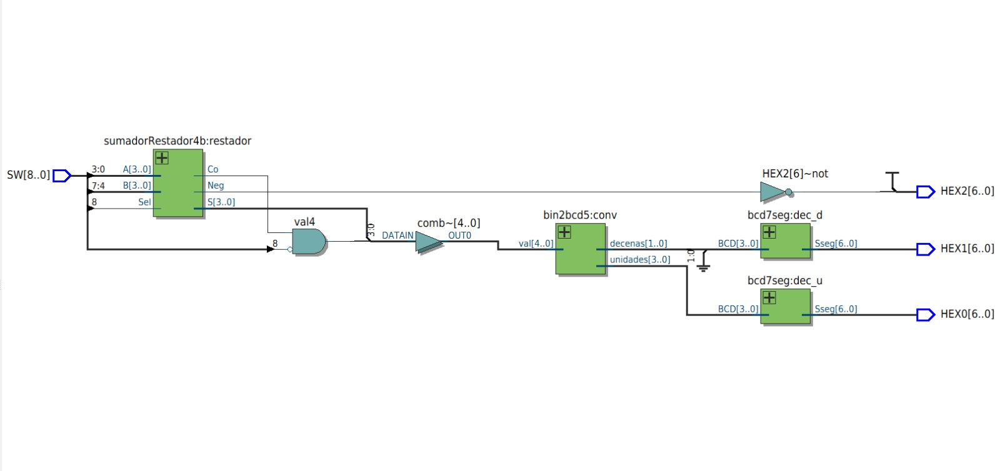
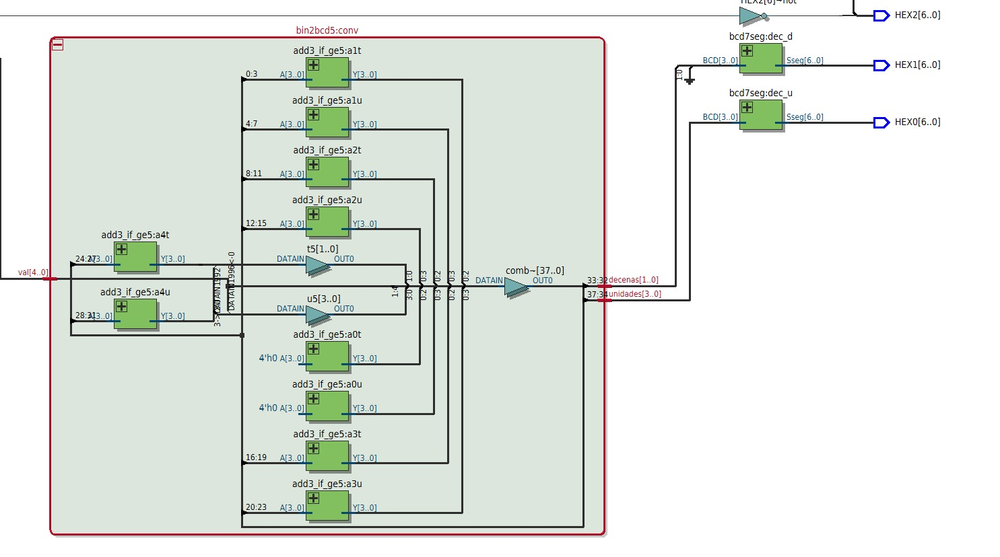
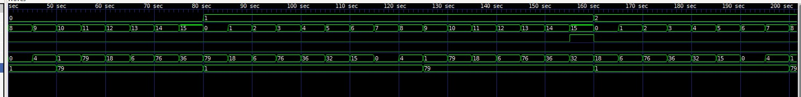

## Lab 02 Sumador restador de 4 bits con 7 segmentos 

## Integrantes
* [Pedro Felipe Jimenez Celis](https://github.compedrofejimenezce-ship-it) 
* [Laura Alejandra Fuentes Ubaque](https://github.com/lauAlejandrxf) 
* [Sebastian Buitrago Oliveros](https://github.com/SebastianBuitrago16) 

## Introducción
Este laboratorio consiste en armar, con puras compuertas lógicas (nada de + o - de Verilog), un circuito que sume o reste dos números de 4 bits y muestre el resultado en displays de 7 segmentos. El circuito decide si suma o resta según un switch, maneja el signo cuando la resta da negativa, convierte el resultado de binario a BCD y lo manda a los displays para verlo como número normal, con su signo si aplica.

## Explicación de codigo

1. Sumador 1 bit

    xor(ab_xor, A, B);
    xor(S, ab_xor, Ci);
XOR en cascada, la suma booleana básica de 3 bits

    and(and1, A, B);
    and(and2, A, Ci);
    and(and3, B, Ci);
    or(or1, and1, and2);
    or(Co, or1, and3);
Calcula el acarreo de salida: Co = (A·B) + (A·Ci) + (B·Ci) — es decir, hay acarreo si al menos dos de las tres entradas están en 1.

2. Sumador 4 bits
    sumador1b bit0(.A(A[0]), .B(B[0]), .Ci(Ci), .S(S[0]), .Co(c1));
    sumador1b bit1(.A(A[1]), .B(B[1]), .Ci(c1), .S(S[1]), .Co(c2));
    sumador1b bit2(.A(A[2]), .B(B[2]), .Ci(c2), .S(S[2]), .Co(c3));
    sumador1b bit3(.A(A[3]), .B(B[3]), .Ci(c3), .S(S[3]), .Co(Co));
Encadena 4 instancias de sumador1b. El acarreo de salida de cada etapa (c1, c2, c3) alimenta el Ci de la siguiente — arquitectura clásica de "propagación de acarreo".

3. Sumador/Restador 4bits

    xor(B_xor[0], B[0], Sel);
    xor(B_xor[1], B[1], Sel);
    xor(B_xor[2], B[2], Sel);
    xor(B_xor[3], B[3], Sel);
    sumador4b uut(.A(A), .B(B_xor), .Ci(Sel), .S(S_raw), .Co(Co));
Si Sel=1 (resta), cada bit de B se invierte (XOR con 1) y se mete Ci=1 → esto forma el complemento a 2 de B, así A + (~B + 1) = A - B. Si Sel=0, B pasa igual y Ci=0 → suma normal.

    not(not_co, Co);
    and(Neg, Sel, not_co);
Neg=1 solo si se está restando y no hubo acarreo de salida (Co=0), lo cual en complemento a 2 significa que el resultado es negativo.

    xor(S_inv[0], S_raw[0], Neg);
    ...
    sumador4b mag(.A(S_inv), .B(4'b0000), .Ci(Neg), .S(S), .Co());
Si el resultado fue negativo (Neg=1), vuelve a sacarle complemento a 2 a S_raw (invertir bits + sumar 1) para obtener la magnitud positiva que se mostrará en pantalla.

4. Comparador

    or  (t_or,  A[1], A[0]);
    and (t_and, A[2], t_or);
    or  (GE5,   A[3], t_and);
Implementa GE5 = A3 + A2·(A1+A0): la lógica booleana mínima para detectar si un número de 4 bits es mayor o igual a 5.

5. Multiplexores 2 a 1

    not(nS, S);
    and(t0, A0, nS);
    and(t1, A1, S);
    or (Y, t0, t1);
mux2_1: si S=0 pasa A0, si S=1 pasa A1 (multiplexor de 1 bit con compuertas).
mux2_4b: instancia 4 mux2_1 en paralelo, uno por bit, para multiplexar buses de 4 bits.

6. Bloque "sumar 3 si ≥ 5"

    ge5_4b cmp(.A(A), .GE5(ge5));
    sumador4b add3(.A(A), .B(4'b0011), .Ci(1'b0), .S(Aplus3), .Co());
    mux2_4b sel(.A0(A), .A1(Aplus3), .S(ge5), .Y(Y));
Compara si A≥5; en paralelo calcula A+3; el multiplexor elige entre A original o A+3 según el resultado de la comparación. Este es el bloque base del algoritmo de conversión binario→BCD.

7. Conversor binario (5 bits, 0–30) a BCD

    supply0 GND;
    buf(t0[0], GND); ... buf(u0[3], GND);
Inicializa los registros de "decenas" (t0) y "unidades" (u0) en 0.

    add3_if_ge5 a0t(.A(t0), .Y(t0a));
    add3_if_ge5 a0u(.A(u0), .Y(u0a));
    buf(t1[3], t0a[2]); buf(t1[2], t0a[1]); buf(t1[1], t0a[0]); buf(t1[0], u0a[3]);
    buf(u1[3], u0a[2]); buf(u1[2], u0a[1]); buf(u1[1], u0a[0]); buf(u1[0], val[4]);
Esto se repite 5 veces (una por cada bit de val, del MSB al LSB). Cada etapa:

-Aplica "sumar 3 si ≥5" a decenas y unidades.
-Hace un shift a la izquierda: el bit que se "sale" de unidades (u0a[3]) entra a decenas, y el siguiente bit de val entra a unidades.

Este es exactamente el algoritmo Double Dabble desenrollado manualmente en 5 etapas combinacionales (una por bit de entrada), en vez de usar un for o un proceso secuencial.

    buf(decenas[0], t5[0]); buf(decenas[1], t5[1]);
    buf(unidades[0], u5[0]); ...
Saca los resultados finales tras la última etapa.

8. de BCD a 7 Segmentos

    not(nw, BCD[3]); not(nx, BCD[2]); not(ny, BCD[1]); not(nz, BCD[0]);
Genera las negadas de cada bit de entrada (w,x,y,z = BCD[3:0]) para armar las ecuaciones de cada segmento.

    and(a_t0, BCD[2], BCD[1]);
    and(a_t1, BCD[3], nz);
    ...
    or(seg_a_hi, a_t0, a_t1, a_t2, a_t3, a_t4, a_t5);
    not(Sseg[6], seg_a_hi);
Cada segmento (a a g) se calcula con su propia ecuación de suma de productos (obtenida por Karnaugh a partir de la tabla de verdad del display de 7 segmentos), y al final se invierte con not porque el display es de ánodo común (activo en bajo). Se repite el mismo patrón para los segmentos b, c, d, e, f, g.

9. Top 

    sumadorRestador4b restador(.A(SW[3:0]), .B(SW[7:4]), .Sel(SW[8]), .S(S_mag), .Co(Co), .Neg(Neg));
Toma los switches: SW[3:0]=A, SW[7:4]=B, SW[8]=Sel (0=suma, 1=resta) y obtiene magnitud, acarreo y signo.

    not(notSel, SW[8]);
    and(val4, Co, notSel);
Si es una suma (Sel=0) y hubo acarreo (Co=1), ese acarreo se trata como un quinto bit (val4) para representar valores hasta 30 (ej. 15+15=30). En la resta el acarreo no se usa así.

    wire [4:0] val;
    buf(val[0], S_mag[0]); ... buf(val[4], val4);
    bin2bcd5 conv(.val(val), .decenas(decenas), .unidades(unidades));
Arma el valor de 5 bits (magnitud + posible acarreo) y lo convierte a BCD (decenas/unidades).

    bcd7seg dec_u(.BCD(unidades), .Sseg({HEX0[0],...,HEX0[6]}));
    bcd7seg dec_d(.BCD({2'b00, decenas}), .Sseg({HEX1[0],...,HEX1[6]}));
Decodifica unidades → HEX0 y decenas → HEX1 para mostrarlos en los displays de 7 segmentos.

    not(HEX2[6], Neg);
    or(HEX2[0], Neg, notNeg); ... or(HEX2[5], Neg, notNeg);
HEX2 se usa solo para mostrar el signo: enciende únicamente el segmento g (el guion central) si Neg=1; los demás segmentos (a-f) se fuerzan a 1 (apagados) sin importar el valor de Neg, gracias al truco Neg OR ~Neg = 1 siempre.

## Diagramas

A continuación se explican los diagramas RTL generados por la herramienta de síntesis, los cuales muestran la interconexión física de las compuertas y módulos primitivos implementados.

### 1. Esquema General del Sistema (Top-Level)

 

En el diagrama principal se observa el flujo de datos completo desde los interruptores de entrada (`SW`) hasta los displays de 7 segmentos (`HEX`):

1. **Entradas (`SW[8..0]`):**
   * `SW[3..0]` corresponden al operando $A$.
   * `SW[7..4]` corresponden al operando $B$.
   * `SW[8]` actúa como la señal de control `Sel` ($0 = \text{Suma}$, $1 = \text{Resta}$).

2. **Bloque `sumadorRestador4b:restador`:**
   * Recibe $A$, $B$ y `Sel`.
   * Procesa la operación mediante la inversión condicional con compuertas **XOR** (para el complemento a 2) y la cascada de **sumadores de 1 bit**.
   * Entrega la magnitud corregida `S[3..0]`, el acarreo de salida `Co` y la bandera de signo `Neg`.

3. **Lógica del 5to Bit (`val4` mediante compuerta AND con inversor):**
   * Se observa una compuerta **AND** que recibe el acarreo `Co` y la señal `Sel` negada ($\sim Sel$).
   * **Explicación:** Si estamos sumando ($Sel = 0$), la entrada negada se vuelve $1$. Si hay un overflow/acarreo ($Co = 1$), la compuerta AND activa `val4 = 1`. Esto permite manejar resultados de suma de hasta 5 bits ($15 + 15 = 30$). En resta ($Sel = 1$), el inversor apaga la compuerta cancelando el acarreo.

4. **Concatenación a Bus de 5 Bits (`val[4..0]`):**
   * Mediante un buffer/combinador (`comb~`), se une la magnitud de 4 bits `S[3..0]` con el bit más significativo `val4` para formar un número binario de 5 bits ($0$ a $30$).

5. **Bloque `bin2bcd5:conv`:**
   * Recibe el bus de 5 bits `val[4..0]` y entrega las Decenas (`decenas[1..0]`) y Unidades (`unidades[3..0]`) en formato BCD.

6. **Decodificadores BCD a 7 Segmentos (`bcd7seg`):**
   * **`dec_u`:** Decodifica las unidades directamente hacia el display `HEX0[6..0]`.
   * **`dec_d`:** Recibe las decenas (completadas con ceros mediante la conexión a tierra/GND observable en el bus) y las manda al display `HEX1[6..0]`.

7. **Manejo del Signo Negativo (`HEX2`):**
   * La señal `Neg` pasa por un buffer e inversor hacia la línea `HEX2[6]` (correspondiente al segmento central o "guion" del display).
   * Las demás líneas de `HEX2` están conectadas a VCC / nivel alto ($1$), manteniéndolas apagadas fija y estructuralmente (ya que los displays son de ánodo común).

---

### 2. Arquitectura Interna del Conversor Binario a BCD (`bin2bcd5`)

Debido a que el laboratorio exigía **no usar lenguaje de alto nivel** (como bucles `for`, sentencias `if/else` o sumas directas), se implementó el algoritmo **Double Dabble (Shift-Add-3)** de manera puramente combinacional y "desenrollada" en hardware:

1. **Bloques `add3_if_ge5` en Cascada:**
   * El diagrama muestra múltiples instancias identificadas como `a0t`, `a0u`, `a1t`, `a1u`, etc. ('t' para *tens*/decenas y 'u' para *units*/unidades).
   * Cada bloque `add3_if_ge5` internamente contiene:
     * Un **Comparador booleano** que evalúa si el nibble es mayor o igual a 5 ($GE5 = A_3 + A_2 \cdot (A_1 + A_0)$).
     * Un **Sumador primitivo de 4 bits** que calcula $A + 3$ (`0011` en binario).
     * Un **Multiplexor de 4 bits** (hecho de compuertas AND-OR-NOT) que selecciona entre el número original o el número $+ 3$ según el resultado del comparador.

2. **Desplazamientos por Interconexión (Shifting):**
   * En lugar de usar registros de desplazamiento con reloj, el *Shift* se realiza conectando físicamente los cables desfasados un bit hacia la izquierda entre cada etapa.
   * La señal recorre las 5 etapas (una por cada bit del vector de entrada `val[4..0]`), convirtiendo el valor binario a BCD mediante propagación lógica combinacional en tiempo real.

---

## Simulaciones

 

En la simulación mediante formas de onda (Waveforms) se verifica el correcto comportamiento temporal y lógico del circuito ante diferentes vectores de prueba:

* **Pruebas de Suma ($Sel = 0$):** Se observa cómo al sumar dos operandos cuyo resultado supera $15$ (por ejemplo $15 + 15$), el bit de acarreo se activa correctamente elevando la salida BCD a $30$, mostrando `'3'` en `HEX1` y `'0'` en `HEX0`.
* **Pruebas de Resta ($Sel = 1$):** 
  * Cuando $A \ge B$, la resta da un resultado positivo, la bandera `Neg` permanece en $0$ y los displays muestran la diferencia exacta.
  * Cuando $A < B$, el circuito realiza automáticamente el complemento a 2 para obtener la magnitud positiva real y conmuta la señal `Neg` a $1$, activando el segmento `-` en el display `HEX2`.
* **Transiciones Combinacionales:** Se comprueba que no existen estados indefinidos (`X` o `Z`) y que la salida de los displays de 7 segmentos sigue la codificación de ánodo común (activa en bajos / $0$).
## Videos
# Práctica 2 - Sumador y Restador de 4 Bits

Circuito digital capaz de sumar o restar dos números de 4 bits mediante compuertas lógicas. La operación se selecciona con un switch y el resultado se muestra en displays de 7 segmentos, incluyendo el signo cuando la resta produce un resultado negativo.

### 🎥 Video de demostración

## Conclusiones 
El circuito funcionó a la perfección: suma y resta correctamente cualquier combinación de los switches, sin errores en ningún caso probado.
Se logró implementar todo el sistema (sumador, complemento a 2, conversión a BCD y decodificación a 7 segmentos) usando solo compuertas lógicas, sin depender de operadores aritméticos de Verilog.
El manejo del signo y del acarreo quedó bien resuelto, mostrando siempre la magnitud correcta y el signo cuando la resta daba negativa.
La conversión binario-BCD con el algoritmo Double Dabble se integró sin problemas, permitiendo representar valores de dos dígitos en los displays.